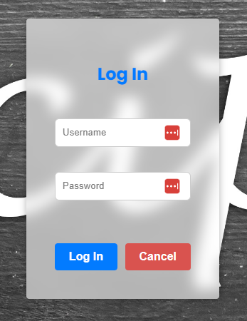
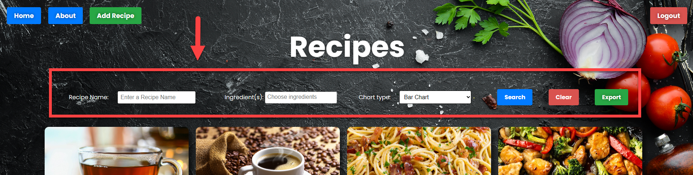
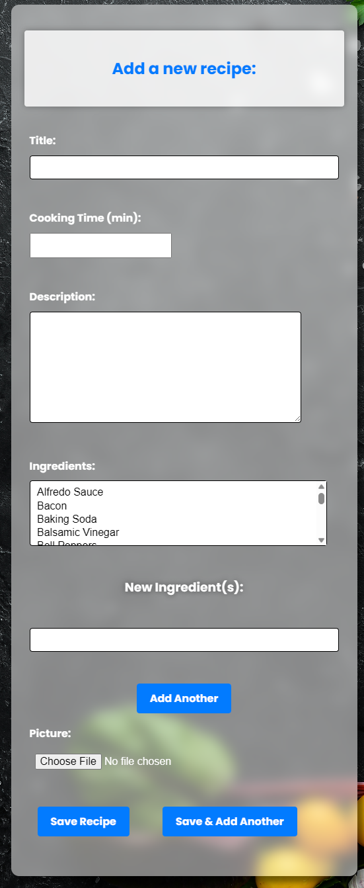
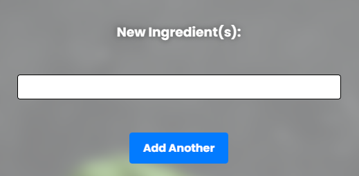

# Recipe Management App

This is a recipe management application that allows users to create, modify, and discover a wide range of recipes. With its user-friendly interface and powerful features, the app simplifies the process of organizing and exploring recipes. Whether you're a cooking enthusiast or a professional chef, this app provides a seamless experience for managing your culinary creations.

## Getting Started

To get started with the Recipe Management App, follow these steps:

1. **Installation**: Ensure you have Python 3.6+ and Django 3 installed on your machine.

2. **Clone the Repository**: Clone the project repository from GitHub to your local machine.

3. **Install Dependencies**: Install the required modules by running the following command in your terminal:

`pip install -r requirements.txt`

4. **Database Configuration**: Set up the database configuration in the project's settings file. For development, use SQLite. For production, configure PostgreSQL.

5. **Run Migrations**: Apply the database migrations using the following command:

`python manage.py migrate`

6. **Start the Server**: Start the development server with the following command:

`python manage.py runserver`

7. **Access the App**: Open a web browser and navigate to `http://localhost:8000` to access the application.

## How to Use the App

### User Registration and Login

- Users can register for an account to access additional features like adding their own recipes and saving favorites.

- On the home page, click the "Register" link to create a new account.

- Once registered, use the "Login" link on the home page to access your account.

### Browsing Recipes

- On the home page, you can see a list of available recipes.

- Use the search bar to search for recipes by title or filter them based on specific ingredients.

### Viewing Recipe Details

- Click on a recipe title from the list to view its details.

- The detailed view provides information such as cooking time, description, and ingredients used.

### Adding New Recipes

- If you are logged in, you can add your own recipes to the database.

- Click the "Add Recipe" link in the navigation menu to access the recipe form.

- Fill in the recipe details, including title, cooking time, description, and ingredients.

- Click "Submit" to add your recipe to the database.

### Exporting Recipes

- Logged-in users can export search results to a CSV file for offline access or reference.

- After performing a search, click the "Export" button to download the search results as a CSV file.

### Data Visualization

- The app offers various chart types for visualizing recipe data based on cooking times.

- Use the "Generate Chart" link in the navigation menu to access data visualization options.

### About Page

- The "About" page provides information about the application and its features.

## Getting Help

If you encounter any issues or need help with the Recipe Management App, you can find support in the following ways:

- **GitHub Repository**: Check the project's GitHub repository for open issues or raise a new issue if needed.

- **Contact the Developer**: You can reach out to the developer, John Dussold, via the contact information provided in his [portfolio](https://jdussold.github.io/portfolio-site/).

## Project Maintenance

The Recipe Management App is currently maintained by the developer, John Dussold. He is responsible for handling bug fixes, feature enhancements, and ensuring the app's continued functionality. Feel free to contribute to the project by submitting pull requests or by providing valuable feedback to improve the application further.

## User Goals

- **Create and Modify Recipes**: Users can easily create new recipes and make modifications to existing ones. The app provides a comprehensive form where users can enter recipe details such as title, cooking time, description, and ingredients. The recipes can be edited at any time to add or remove ingredients, update cooking instructions, or make any other desired changes.

- **Search for Recipes by Ingredient**: The app offers a convenient search functionality that allows users to find recipes based on specific ingredients. Users can simply enter the ingredient they have on hand, and the app will display a list of matching recipes. This feature is particularly helpful for users looking to make use of ingredients in their pantry or fridge.

- **View Detailed Recipe Information**: Users can access detailed information about each recipe, including the title, cooking time, description, and ingredients. This allows users to get a complete understanding of the recipe before deciding to try it out. The app provides an organized and visually appealing display of recipe details to enhance the user experience.

- **Automatic Recipe Rating**: The app automatically rates recipes based on their difficulty level. The difficulty level is calculated by considering factors such as cooking time and the number of ingredients. Users can quickly identify easy, medium, intermediate, or hard recipes based on the ratings. This feature helps users choose recipes that match their skill level and available time.

- **Add User Recipes to the Database**: The app allows users to contribute their own recipes to the recipe database. Users can easily add their recipes, including all the necessary details and ingredients. By sharing their culinary creations with the community, users can inspire others and contribute to the growing collection of recipes.

- **Django Admin Dashboard**: The app includes a Django Admin dashboard, which provides a user-friendly interface for managing database entries. With the dashboard, administrators can efficiently add, edit, and delete recipes, ingredients, and other related data. This feature simplifies the administrative tasks and ensures smooth operation of the app.

- **Access Statistics and Visualizations**: The app goes beyond basic recipe management by offering statistics and visualizations based on recipe trends and data analysis. Users can gain insights into popular ingredients, most-rated recipes, and other interesting patterns. These insights can help users discover new recipes, identify cooking trends, and make informed decisions in their culinary endeavors.

- **Database Connectivity and Design**: The app connects to a PostgreSQL database for production. During development, an SQLite database is used. The database configuration can be easily set up in the project's settings file.

## Models Overview

The application uses three main models to manage recipes and ingredients:

1. **Recipe Model** (`recipes\models.py`):

- `title`: The title of the recipe (CharField).
- `cooking_time`: The cooking time in minutes (PositiveIntegerField).
- `description`: A detailed description of the recipe (TextField).
- `difficulty`: The difficulty level of the recipe, automatically calculated based on cooking time and number of ingredients (CharField).
- `ingredients`: A ManyToMany relationship with the `Ingredient` model through the `RecipeIngredient` model.

2. **Ingredient Model** (`ingredients\models.py`):

- `name`: The name of the ingredient (CharField).

3. **RecipeIngredient Model** (`recipeingredients\models.py`):

- `recipe`: A ForeignKey relationship with the `Recipe` model, representing the recipe that uses the ingredient.
- `ingredient`: A ForeignKey relationship with the `Ingredient` model, representing the ingredient used in the recipe.

## Calculating Recipe Difficulty

The `Recipe` model has a method named `calculate_difficulty` that automatically calculates the recipe difficulty based on the cooking time and the number of ingredients. The difficulty is determined as follows:

- If the cooking time is less than 10 minutes and the number of ingredients is less than 4, the recipe is classified as "Easy."
- If the cooking time is less than 10 minutes and the number of ingredients is 4 or more, the recipe is classified as "Medium."
- If the cooking time is 10 minutes or more and the number of ingredients is less than 4, the recipe is classified as "Intermediate."
- If the cooking time is 10 minutes or more and the number of ingredients is 4 or more, the recipe is classified as "Hard."

## Database Entities

The application's database includes the following entities and their corresponding attributes:

- **User**:

- `id`: Unique Identifier (AutoField)
- `username`: User's username (CharField)
- `password`: User's password (CharField)

- **Recipe**:

- `id`: Unique Identifier (AutoField)
- `user_id (FK)`: ForeignKey to User model (Foreign Key)
- `title`: Recipe title (CharField)
- `description`: Recipe description (CharField)
- `cooking_time`: Cooking time in minutes (PositiveIntegerField)
- `difficulty`: Recipe difficulty (CharField)

- **Ingredient**:

- `id`: Unique Identifier (AutoField)
- `name`: Ingredient name (CharField)

- **RecipeIngredient**:
- `id`: Unique Identifier (AutoField)
- `recipe_id (FK)`: ForeignKey to Recipe model (Foreign Key)
- `ingredient_id (FK)`: ForeignKey to Ingredient model (Foreign Key)
- `quantity`: Quantity of the ingredient used in the recipe (IntegerField)

Here are the tables representing these entities:

### User

| Attribute | Type              |
| --------- | ----------------- |
| id        | Unique Identifier |
| username  | String            |
| password  | String            |

### Recipe

| Attribute    | Type              |
| ------------ | ----------------- |
| id           | Unique Identifier |
| user_id (FK) | Foreign Key       |
| title        | String            |
| description  | String            |
| cooking_time | Integer           |
| difficulty   | String            |

### Ingredient

| Attribute | Type              |
| --------- | ----------------- |
| id        | Unique Identifier |
| name      | String            |

### RecipeIngredient

| Attribute          | Type              |
| ------------------ | ----------------- |
| id                 | Unique Identifier |
| recipe_id (FK)     | Foreign Key       |
| ingredient_id (FK) | Foreign Key       |
| quantity           | Integer           |

## URLs

The app's URL configuration is as follows:

### Main Project URLs (`recipe_project\urls.py`):

- `/admin/`: Django Admin dashboard for managing database entries.
- `/`: Includes the `recipes.urls` for handling recipe-related URLs.
- `/login/`: URL for user login view.
- `/logout/`: URL for user logout view.
- `/success/`: URL for the success page after adding a new recipe.

### Recipes App URLs (`recipes\urls.py`):

- `/`: URL for the home page displaying a list of recipes.
- `/recipes/add/`: URL for adding a new recipe.
- `/recipes/export/`: URL for exporting recipes to a CSV file.
- `/generate-chart/`: URL for generating data visualization charts.
- `/recipes/<int:pk>/`: URL for viewing the details of a specific recipe.
- `/about/`: URL for the "About" page with information about the application.
- `/recipes/`: URL for displaying a list of recipes.

## Forms and Functionality

### Recipe Search Form

The app includes a search form named `RecipeSearchForm` that allows users to search for recipes based on recipe name, specific ingredients, and a choice of chart type for data visualization. Users can enter a recipe name or select one or more ingredients to filter the recipes. Additionally, users can choose from available chart types to visualize recipe data.

### Recipe Form

The `RecipeForm` class is a ModelForm that is used for adding new recipes to the database. It allows users to enter recipe details such as title, cooking time, description, and ingredients. The form automatically calculates the recipe difficulty based on the cooking time and total number of ingredients.

### New Ingredient Form

The `NewIngredientForm` class is a simple form that allows users to add new ingredients while adding a new recipe. Users can enter the name of the new ingredient, and it will be saved in the database and associated with the recipe.

## Technical Requirements

To run the application, ensure the following technical requirements are met:

- **Python 3.6+ and Django 3 installations**: The app is built using Python programming language and utilizes Django, a high-level web framework, for efficient development.

- **Exception Handling**: The application incorporates robust exception handling to gracefully handle errors that may occur during user input. It provides user-friendly error messages to guide users in resolving any issues.

- **Database Connectivity**: The app connects to a PostgreSQL database for production. During development, an SQLite database is used. The database configuration can be easily set up in the project's settings file.

- **User-Friendly Interface**: The app prioritizes user experience with an intuitive and easy-to-use interface. It offers simple forms of input, clear instructions, and neatly presented menus for login and logout.

- **Documentation and Tests**: The app is thoroughly documented, making it easy for developers to understand and modify the codebase. Additionally, it includes automated tests to ensure proper functionality. The project is uploaded to GitHub, along with a "requirements.txt" file containing the necessary modules.

## Further Improvements

The current version of the app includes essential functionality for recipe management. However, there are several opportunities for further improvements and feature enhancements. Here are some suggestions for extending the app's capabilities:

- **User Authentication and Management**: Implement user registration and authentication features to allow users to create accounts, log in, and manage their recipes.

- **Recipe Ratings and Reviews**: Introduce a rating and review system for recipes, allowing users to share their feedback and experiences with others.

- **User Profiles and Social Features**: Create user profiles where users can view and manage their added recipes and interact with other users by following, favoriting, or sharing recipes.

- **Recipe Categories and Tags**: Enhance recipe organization by introducing categories and tags, making it easier for users to find specific types of recipes.

- **Improved Data Analysis**: Extend the data analysis capabilities by exploring additional trends, such as most popular ingredients, average cooking times, and seasonal recipe trends.

- **Recipe Images and Multimedia**: Allow users to upload images and multimedia content for their recipes, enhancing the visual appeal and user engagement.

- **Recipe Recommendations**: Implement a recommendation system that suggests personalized recipes based on user preferences and cooking history.

## Conclusion

The Recipe Management App provides a solid foundation for users to manage, explore, and share their culinary creations. With its user-friendly interface, search functionality, and data visualizations, the app empowers cooking enthusiasts and professional chefs alike. The suggested improvements can further enhance the app's functionality and user experience, making it a comprehensive solution for recipe management and culinary inspiration. Feel free to explore and contribute to the app's development on GitHub. Happy cooking!

## About The Developer

My name is John Dussold, and I'm the developer of this fantastic Recipe App. I had a lot of fun designing this app from back to front, and I'm thrilled to share it with you. If you want to see more of my work, please check out my portfolio, GitHub, and contact information at the following links.

- [Portfolio](https://jdussold.github.io/portfolio-site/)
- [GitHub](https://github.com/jdussold)
